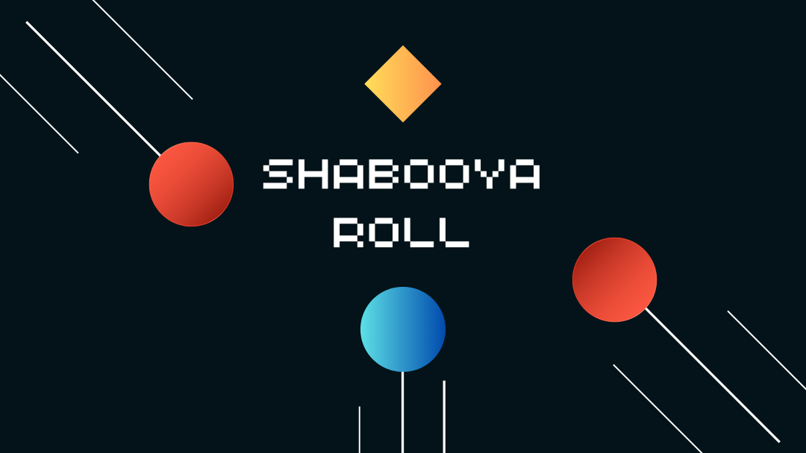

# Shabooya Roll, a Roll-a-Ball Game

In this game, players roll a ball around to pick up special items called shabooyas. But watch out! There are red enemies chasing you. Can you grab all the shabooyas without getting caught? Roll, collect, and see if you can win!

Your goal is to collect all 10 shabooyas that are spread across the map before the time runs out!

# Credits and Acknowledgements

I wish to express my gratitude to the following individuals and organizations for their invaluable contributions to the development of Shabooya Roll:

## Code Contributions:

1. Contributor: Unity Learn
    - Contribution: Roll-a-Ball Tutorial
    - Contact/Website: https://learn.unity.com/project/roll-a-ball?uv=2022.3

1. Contributor: Coding in Flow
    - Contribution: Start and Game Over Screen Tutorial
    - Contact/Website: https://youtu.be/1Ye-mCuIIdw?si=FvzyKx5-gYiDMYhp

1. Contributor: Yiğithan Demirçin
    - Contribution: Game Timer Tutorial
    - Contact/Website: https://mobidictum.com/game-industry/unity-timer/

## Asset Contributions:

1. Contributor: Jakob Fischer
    - Contribution: Font
    - Contact/Website: https://www.1001fonts.com/arcadeclassic-font.html
